Este documento consolida as evidências de execução da suíte de testes automatizados para o sistema de **Inventário CTI da PGE-CE**, detalhando o comportamento dos cenários propostos, bugs impeditivos mapeados durante o desenvolvimento e melhorias arquiteturais.

---

## 📊 Resumo Executivo da Execução

- **Total de Cenários Planejados:** 23
- **Cenários Passados (Sucesso):** 18
- **Cenários Falhados/Bloqueados:** 5
- **Taxa de Cobertura (Success Rate):** 78,26%

* **Ambiente de Testes:** `http://testeqa.pge.ce.gov.br/`

---

## 🔍 Evidências por User Story

### US01 - Cadastro de Atribuições

#### Cenário 01: Deve cadastrar múltiplos ativos para colaborador em Home Office.

- **Resultado:** Passou com sucesso.

- **Análise técnica:** O teste realizou o preenchimento dos dados básicos de triagem, marcou a opção do pacote Office, incluiu dois ativos consecutivamente informando os tombos disponíveis e efetuou o salvamento. A validação foi concluída confirmando a exibição do alerta de sucesso com o texto contendo "Parabéns".

- **Evidência Visual:**
  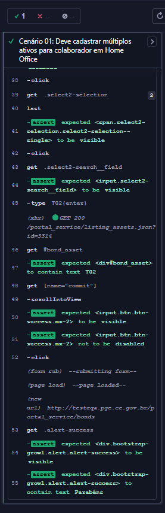

#### Cenário 02: Deve cadastrar atribuição exclusiva para subárea sem colaborador.

- **Resultado:** Falhou.

- **O que foi feito:** O script selecionou os campos de Área e Subárea, marcou a opção correspondente à subárea, preencheu o atendente responsável e inseriu dois ativos pelos tombos indicados. Após o clique no botão de salvar, a aplicação não retornou a mensagem de sucesso aguardada (`.alert-success`), gerando falha por timeout, caracterizando uma falha ou restrição da própria aplicação ao tentar salvar um registro sem vincular um colaborador individual.

- **Evidência Visual:**
  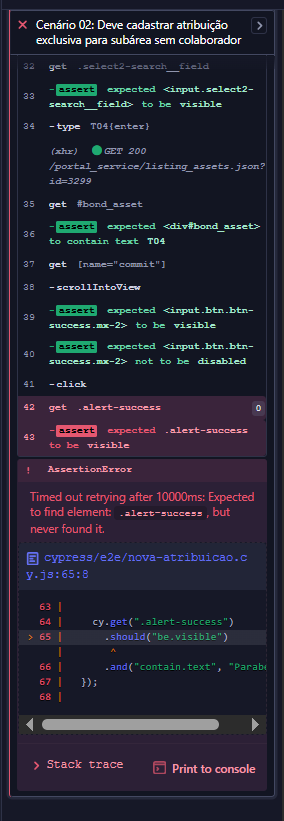

#### Cenário 03: Não deve permitir salvar sem preencher campos obrigatórios.

- **Resultado:** Passou com sucesso.

- **O que foi feito:** O teste disparou o clique diretamente no botão de salvar com o formulário em branco. Em seguida, capturou a propriedade `validationMessage` do elemento para garantir o bloqueio nativo de obrigatoriedade do navegador e validou que nenhum alerta de sucesso foi gerado.

- **Evidência Visual:**
  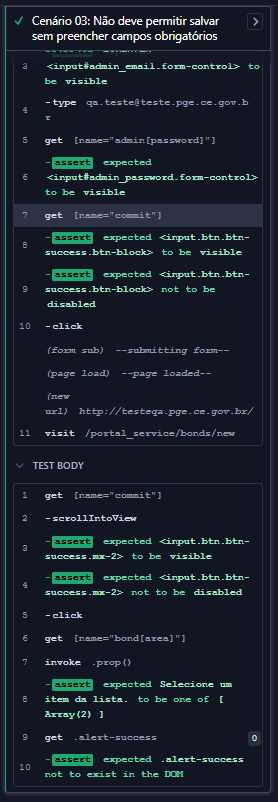

#### Cenário 04: Deve habilitar campo Pacote Office apenas quando checkbox estiver marcado.

- **Resultado:** Passou com sucesso.

- **O que foi feito:** O script validou os estados inicial desmarcado/desabilitado do checkbox e do select do Pacote Office. Na sequência, efetuou a marcação (`check`) confirmando a liberação do campo, e encerrou desmarcando o item (`uncheck`) para garantir que o componente retornou ao estado desabilitado.

- **Evidência Visual:**
  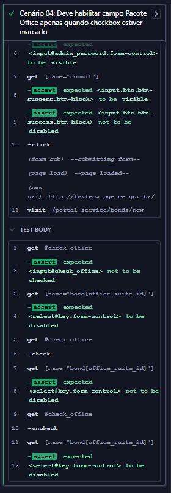

#### Cenário 05: Não deve permitir vincular ativo já utilizado.

- **Resultado:** Passou com sucesso.

- **O que foi feito:** O script preencheu os dados básicos de uma nova atribuição utilizando a modalidade Presencial e tentou adicionar um ativo informando um tombo que já se encontrava em uso no sistema (`16827`). Após comandar o salvamento, o teste confirmou o bloqueio da aplicação ao validar a exibição do alerta com o texto "Este Ativo já está vinculado".

- **Evidência Visual:**
  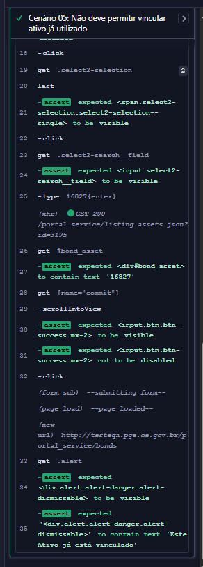

#### Cenário 06: Deve descartar informações ao cancelar cadastro.

- **Resultado:** Passou com sucesso.

- **O que foi feito:** O teste digitou uma string dinâmica única no campo de observações utilizando o timestamp atual e clicou no botão de cancelar. Em seguida, validou o redirecionamento automático para a listagem principal e confirmou que a string digitada não foi salva ou exposta na tela.

- **Evidência Visual:**
  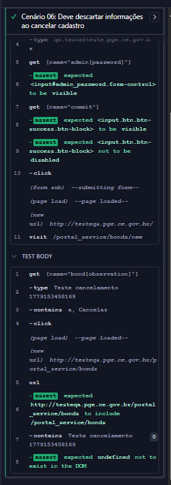

### US02 - Editar Atribuições

#### Cenário 01: Validar se todos os campos carregam os dados corretamente ao clicar em "Editar".

- **Resultado:** Falhou.

- **O que foi feito:** O script acessou a listagem, clicou na ação de editar o primeiro registro e validou a presença dos ativos vinculados, da Área e da Subárea. A execução foi interrompida com uma falha de asserção no campo "Atendido Por", pois a aplicação limpou o campo exibindo "Selecione ..." em vez de persistir e carregar o atendente original ("Atendente").

- **Evidência Visual:**
  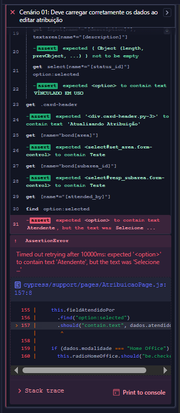

#### Cenário 02: Remover um ativo selecionando o status "COM DEFEITO", informar o motivo e adicionar um novo ativo substituto.

- **Resultado:** Bloqueado (Blocked).

- **Motivo técnico do bloqueio:** O script aciona o método `AtribuicaoPage.substituirAtivo()` para passar o tombo atual para o estado "COM DEFEITO", preencher a justificativa e incluir o novo ativo. Contudo, como a tela carrega o campo obrigatório "Atendido Por" em branco (Bug do Cenário 01), a tentativa de disparo do método `AtribuicaoPage.clicarEmSalvar()` é rejeitada pela validação de integridade do formulário da própria aplicação, impedindo a conclusão do fluxo de substituição do ativo avariado.

- **Evidência Visual:**
  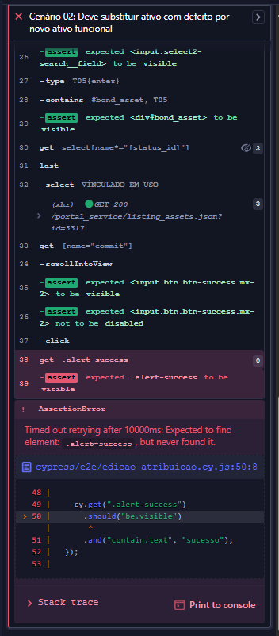

#### Cenário 03: Realizar a troca de um ativo funcional selecionando status "DISPONÍVEL" antes da remoção.

- **Resultado:** Bloqueado (Blocked).

- **Motivo técnico do bloqueio:** Semelhante ao cenário anterior, o teste tenta executar a regra de negócio de substituição preventiva de um ativo saudável, devolvendo o antigo para o estoque com o status "DISPONÍVEL". O comando `AtribuicaoPage.clicarEmSalvar()` falha, pois o sistema falha em persistir o atendente original no carregamento do formulário, tornando impossível testar a devolução correta do ativo ao inventário.

- **Evidência Visual:**
  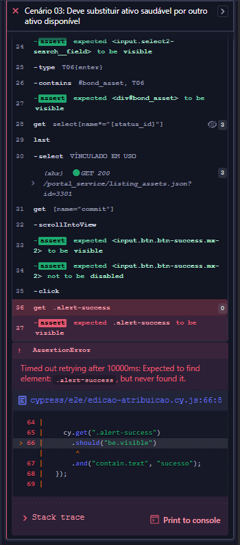

#### Cenário 04: Modificar a Área/Subárea de uma atribuição e validar a atualização na listagem principal.

- **Resultado:** Bloqueado (Blocked).

- **Motivo técnico do bloqueio:** O script executa o método `AtribuicaoPage.alterarAreaESubarea()` para redefinir a estrutura para "CEDAT" e "DIVIDA ATIVA". Embora a alteração dos selects de localidade ocorra no DOM, o salvamento é bloqueado devido à inconsistência do campo de atendente. Como consequência, o fluxo é interrompido antes que possa retornar à listagem principal para executar a asserção final planejada em `AtribuicaoPage.validarPrimeiraLinhaTabela()`.

- **Evidência Visual:**
  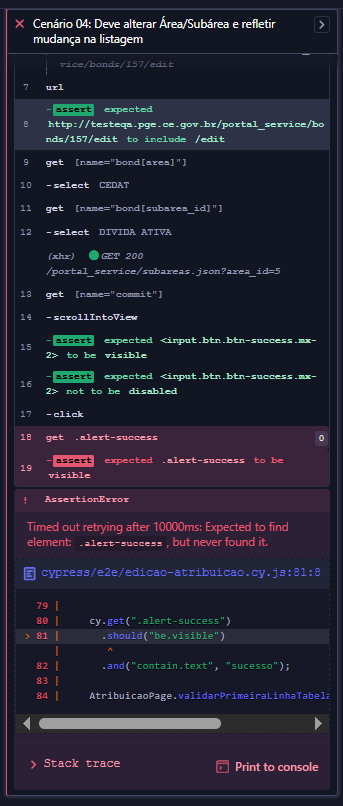

#### Cenário 05: Tentar salvar uma edição removendo o conteúdo de um campo obrigatório (\*) e validar se o sistema bloqueia a atualização.

- **Resultado:** Passou com sucesso.

- **O que foi feito:** O script abriu a tela de edição, forçou a limpeza do campo "Área" (selecionando uma opção vazia) e disparou o comando `AtribuicaoPage.clicarEmSalvar()`. O teste confirmou a eficácia do bloqueio nativo do navegador ao capturar e validar a propriedade `validationMessage` do elemento e assegurar que nenhum alerta de sucesso foi emitido.

- **Evidência Visual:**
  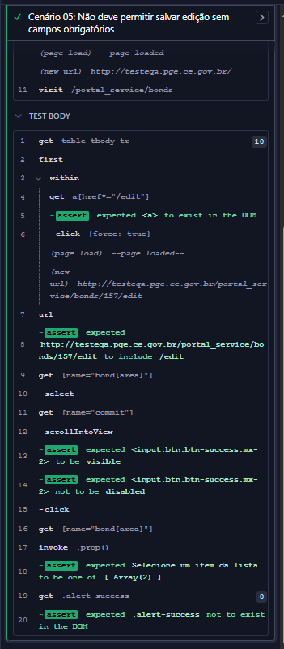

### US03 - Geração de Termos

#### Cenário 01: Validar comportamento de exclusão mútua dos checkboxes no modal.

- **Resultado:** Passou com sucesso.

- **O que foi feito:** O script abriu o modal de termos do primeiro registro, marcou a opção "Termo de Responsabilidade" e, em seguida, marcou "Termo de Empréstimo". O teste confirmou a regra de exclusão mútua de interface ao validar que o primeiro checkbox foi desmarcado automaticamente pelo sistema.

- **Evidência Visual:**
  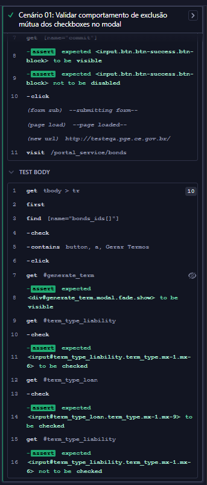

#### Cenário 02: Validar fechamento do modal pelo botão de fechar (X).

- **Resultado:** Passou com sucesso.

- **O que foi feito:** O teste acionou a abertura do modal de termos, aplicou uma breve espera para a estabilização da animação em tela e forçou o clique no botão de fechamento (X). A asserção validou com sucesso que o modal deixou de ficar visível na interface.

- **Evidência Visual:**
  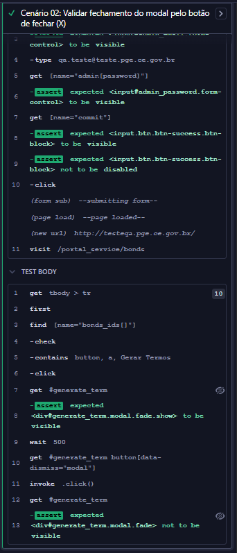

#### Cenário 03: Gerar Termo de Responsabilidade com sucesso.

- **Resultado:** Passou com sucesso.

- **O que foi feito:** O script interceptou a abertura de novas abas no navegador (`win.open`), acessou o modal, selecionou o tipo Responsabilidade e clicou em gerar. O teste validou que o gatilho de impressão foi disparado apontando para a rota correta do endpoint `/term_responsibility_asset`.

- **Evidência Visual:**
  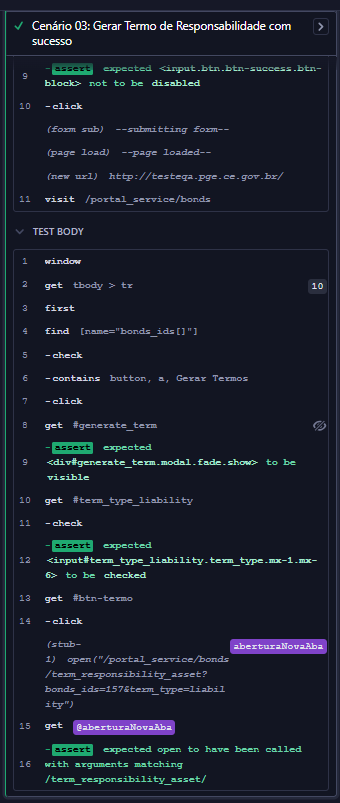

#### Cenário 04: Gerar Termo de Empréstimo com sucesso.

- **Resultado:** Passou com sucesso.

- **O que foi feito:** Utilizando a mesma estratégia de stub, o teste selecionou o tipo Empréstimo no modal e disparou a geração. A validação confirmou que o sistema chamou a rota de geração injetando corretamente o parâmetro query string correspondente ao tipo selecionado (`term_type=loan`).

- **Evidência Visual:**
  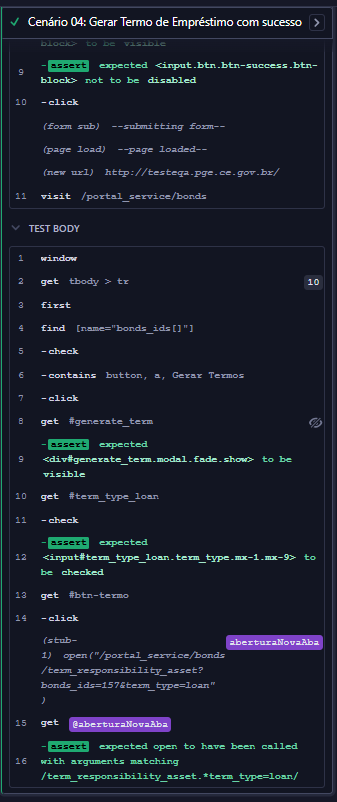

#### Cenário 05: Validar se o PDF gerado contém todos os campos obrigatórios.

- **Resultado:** Passou com sucesso.

- **O que foi feito:** O teste executou o fluxo completo de geração, capturou a URL do documento e realizou uma requisição HTTP (`cy.request`) para baixar o arquivo binário. O PDF foi salvo localmente e processado via `cy.task('getPdfText')`. O script validou via expressões regulares a presença dos campos obrigatórios (Nome, Área, CPF, Ativos, Assinatura), a estrutura de localidade, data atualizada dinamicamente e o texto jurídico condicional do termo.

- **Evidência Visual:**
  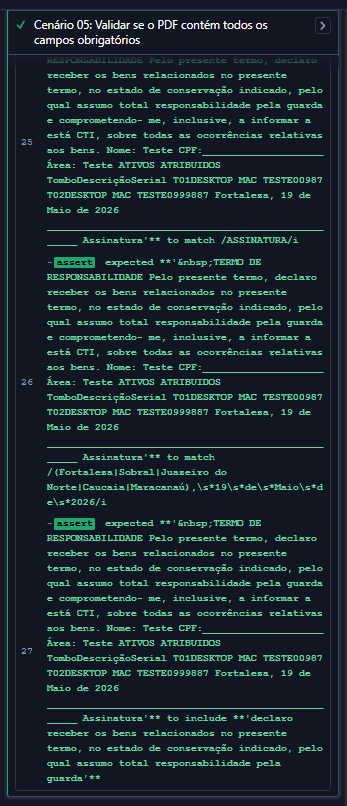

### US04 - Relatório de Movimentação de Ativos

#### Cenário 01: Validar filtros obrigatórios e comportamento sem dados disponíveis.

- **Resultado:** Passou com sucesso.

- **O que foi feito:** O script aplicou filtros em um range de datas retroativas sem movimentações reais registradas. O teste confirmou a robustez do tratamento de exceções da interface ao certificar a exibição da mensagem de alerta com o texto "Sem movimentações para: ".

- **Evidência Visual:**
  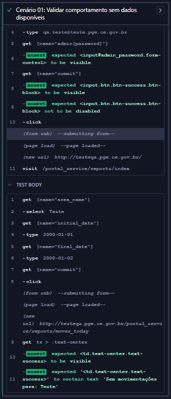

#### Cenário 02: Validar listagem em tela com agrupamento por Área e Data.

- **Resultado:** Passou com sucesso.

- **O que foi feito:** O teste aplicou filtros de período do mês corrente e percorreu os cabeçalhos de agrupamento retornados pela listagem. Utilizando expressões regulares, o script validou que o sistema mantém a padronização gramatical de datas (ex: "X de Maio de 2026 - Y movimentações").

- **Evidência Visual:**
  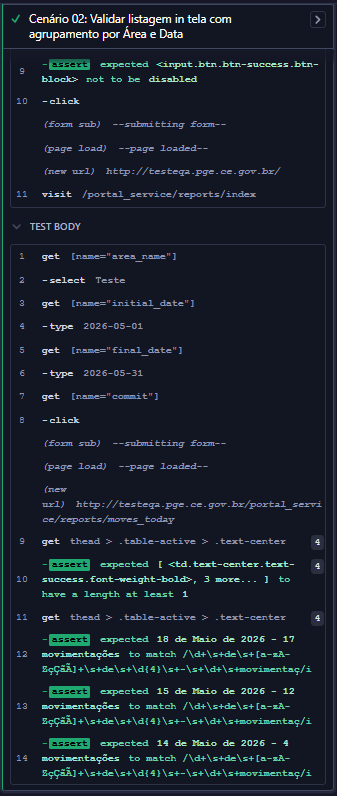

#### Cenário 03: Validar a presença de todas as colunas obrigatórias do Ativo na listagem.

- **Resultado:** Passou com sucesso.

- **O que foi feito:** O script acionou os filtros de listagem e utilizou o escopo interno (`.within()`) na primeira linha de dados retornada no DOM. O teste validou de forma sequencial que todas as 6 colunas obrigatórias relativas aos dados do Ativo estavam visíveis e com strings devidamente preenchidas.

- **Evidência Visual:**
  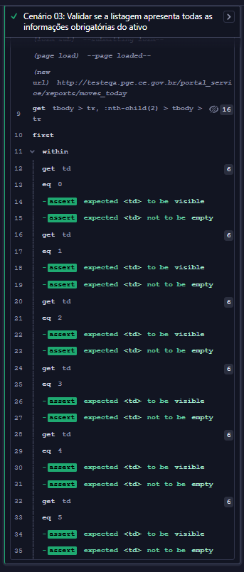

#### Cenário 04: Validar geração de Relatório PDF espelhando os filtros em tela.

- **Resultado:** Passou com sucesso.

- **O que foi feito:** Após preencher os critérios de busca em tela, o teste disparou uma requisição HTTP (`cy.request`) para o endpoint de exportação injetando as query strings parametrizadas. O documento foi parseado localmente e o script validou se os dados do filtro foram espelhados no título, a presença das colunas estruturais do inventário (Tombo, Série, Descrição, Lotações, Colaborador) e a listagem de registros consolidados.

- **Evidência Visual:**
  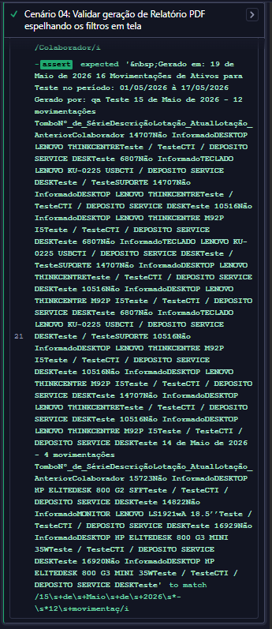

### US05 - Relatório de Atribuições por Área/Subárea

> 📝 Durante a fase de mapeamento de cenários, foi identificada uma inconsistência crítica no documento de especificação (PDF). Os critérios de aceitação da US05 foram replicados erroneamente a partir da US04 (Movimentações). A suíte de testes da US05 foi inteiramente projetada com base nas regras de negócio e componentes reais presentes na rota da aplicação (`/assignments_by_area`), distinguindo com sucesso os modos de visualização Sintético e Analítico.

#### Cenário 01: Validar exibição do Relatório Sintético e seus gráficos gerados.

- **Resultado:** Passou com sucesso.

- **O que foi feito:** O script configurou o filtro selecionando a modalidade "Sintético" para uma área informada. O teste validou a renderização dos elementos visuais da tela, certificando que o sistema gerou os cards informativos de totais e os 6 gráficos estatísticos de distribuição (Modalidade, Colaboradores, Termos de Responsabilidade, Termos de Empréstimo, Sistema Operacional e Pacote Office).

- **Evidência Visual:**
  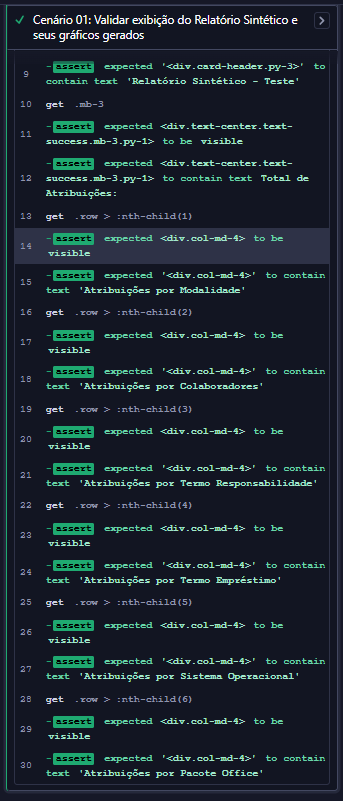

#### Cenário 02: Validar estrutura do Relatório Analítico e tabela detalhada.

- **Resultado:** Passou com sucesso.

- **O que foi feito:** O teste aplicou o filtro na opção "Analítico" e validou a mudança estrutural da página. O script confirmou a presença da tabela de resumo de Área/Subárea e inspecionou as colunas do relatório detalhado, garantindo a exibição correta dos campos de Colaborador(a), Modalidade, Termo Empréstimo e Status.

- **Evidência Visual:**
  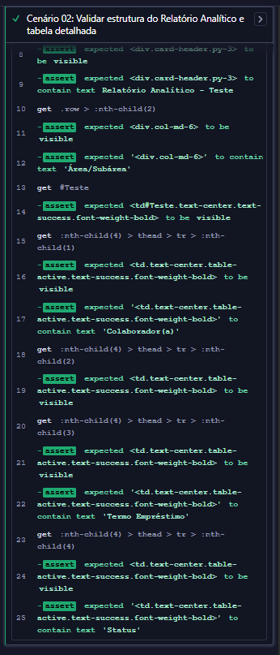

#### Cenário 03: Validar a consistência do Relatório PDF gerado no modo Analítico.

- **Resultado:** Passou com sucesso.

- **O que foi feito:** O teste realizou a filtragem em tela e capturou dinamicamente os IDs dos elementos de Área e Subárea no DOM para estruturar a URL de exportação. Através de um `cy.request()`, o binário do PDF foi baixado, salvo localmente e processado. O script validou no corpo do documento o título ("Relatório de Atribuições"), a data de geração formatada por extenso segundo o relógio do sistema e a presença das palavras-chave estruturais do inventário (Tombo, Descrição e Atribuído).

- **Evidência Visual:**
  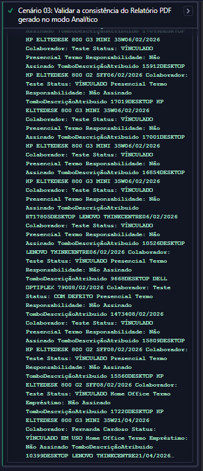

## 🛠️ Sugestões Técnicas e Propostas de Melhoria para o Sistema

Após a execução da suíte completa de testes automatizados e análise do comportamento do **Inventário CTI**, foram mapeadas oportunidades de melhoria técnica e de experiência do usuário (UX) que elevarão a confiabilidade, integridade e usabilidade da aplicação.

### 1. Correção de Inconsistência de Dados (Persistência no Formulário de Edição)

- **Contexto:** Identificado na **US02 (Cenário 01)** que o campo obrigatório "Atendido Por" é limpo pelo sistema ao carregar a tela de edição, bloqueando os fluxos subsequentes de substituição e movimentação de ativos.

- **Proposta Técnica:** Implementar uma validação no ciclo de vida de carregamento da rota de edição para garantir que o estado inicial popule corretamente todos os elementos.

### 2. Aperfeiçoamento da Validação de Negócio

- **Contexto:** Na **US01 (Cenário 02)**, o sistema permitiu preencher o formulário para uma subárea sem colaborador, mas não disparou o alerta de sucesso e nem concluiu a operação após o clique em salvar.

- **Proposta Técnica:** \* **Se o comportamento for permitido:** Corrigir o fluxo de salvamento no backend para aceitar registros onde a chave estrangeira do colaborador seja nula.
  - **Se o comportamento for proibido:** Adicionar uma validação reativa no front-end. Caso o radio de "Subárea" seja marcado, o sistema deve aplicar dinamicamente o atributo `required` ou exibir uma mensagem clara em tela informando a obrigatoriedade ou impedimento da ação, em vez de quebrar silenciosamente.

### 3. Sincronização e Atualização da Documentação de Requisitos

- **Contexto:** Identificado na **US05** que as especificações de critérios de aceitação fornecidas no documento base estavam duplicadas e desalinhadas com as funcionalidades reais da tela de Relatório de Atribuições por Área.

- **Proposta Técnica:** Estabelecer uma cultura de "Mapeamento Vivo de Requisitos" (Living Documentation). Sugere-se a atualização do backlog e das especificações funcionais para refletirem as visões **Sintética** (gráficos analíticos) e **Analítica** (tabela nominal) existentes no sistema, evitando retrabalho das equipes de desenvolvimento e testes em sprints futuras.

### 4. Feedback Visual e Mensagens de Erro Amigáveis (Friendly Errors)

- **Contexto:** Em cenários de erro ou bloqueio (como na tentativa de salvar campos em branco), a aplicação depende exclusivamente das mensagens nativas do navegador (`validationMessage` do HTML5).

- **Proposta Técnica:** Embora a validação nativa seja eficiente, para uma melhor experiência do usuário (UX), propõe-se a adoção de componentes de validação customizados como _Toasts_ de alerta ou mensagens de erro vermelhas para cada campo específico, padronizando o comportamento visual do sistema independentemente do navegador utilizado pelo usuário.

### 5. Tratamento do Fluxo de Exportação no Relatório Sintético

- **Contexto:** Durante a execução da **US05**, foram realizados testes exploratórios adicionais devido às inconsistências identificadas nos critérios de aceitação da funcionalidade. Nesse processo, foi identificado que ao utilizar filtros válidos no modo **Sintético** e posteriormente acionar o botão **"Gerar Relatório"**, a aplicação redireciona o usuário para uma tela de recarregamento/erro, sem gerar qualquer arquivo PDF ou retornar feedback funcional positivo. O comportamento ocorre especificamente quando o relatório está configurado no modo Sintético, enquanto o mesmo botão funciona corretamente em outros cenários analíticos da aplicação.

- **Proposta Técnica:** Caso a exportação PDF para o modo **Sintético** ainda não tenha sido implementada, recomenda-se desabilitar dinamicamente o botão **"Gerar Relatório"** quando a opção Sintético estiver selecionada, evitando que o usuário acione um fluxo indisponível e seja redirecionado para uma tela de erro. Alternativamente, caso a funcionalidade de exportação seja prevista pela regra de negócio, sugere-se corrigir o endpoint responsável pela geração do PDF e implementar mensagens de feedback apropriadas para cenários de falha, garantindo previsibilidade e melhor experiência do usuário.

### 6. Inconsistência no Carregamento do Campo "Utilizará Pacote Office?"

- **Contexto:** Durante os testes da funcionalidade de cadastro de atribuições, foi identificado um comportamento inconsistente relacionado ao campo **"Utilizará Pacote Office?"**. Ao marcar o checkbox correspondente, o sistema habilita corretamente o select associado, porém as opções esperadas não são carregadas na rota de cadastro. Em contrapartida, após concluir o cadastro e acessar posteriormente a mesma atribuição pela rota de edição, o select passa a carregar normalmente a lista de opções disponíveis.

- **Proposta Técnica:** O comportamento observado sugere uma possível falha no carregamento inicial dos dados do select durante a criação de novas atribuições, possivelmente relacionada à ausência de inicialização do componente ou da chamada responsável por popular as opções no carregamento da rota de cadastro. Recomenda-se revisar o fluxo de inicialização do campo para garantir consistência entre os modos de criação e edição. Caso exista alguma regra de negócio que justifique o carregamento apenas na edição, sugere-se explicitar visualmente essa limitação ao usuário, evitando ambiguidades e comportamento aparentemente inconsistente na interface.

### 7. Melhoria na Experiência de Seleção de Ativos Disponíveis

- **Contexto:** Durante os testes exploratórios e a automação do fluxo de cadastro de atribuições, foi identificado um problema de experiência do usuário relacionado ao processo de seleção de ativos no botão **"Atribuir Ativo"**. Atualmente, o select responsável pela escolha do tombo exibe todos os ativos cadastrados no sistema, independentemente do status de disponibilidade. Com isso, o usuário consegue selecionar ativos que já estão vinculados a outras atribuições.

- **Impacto Observado:** O comportamento atual pode gerar frustração e retrabalho operacional, especialmente em cenários onde múltiplos ativos são adicionados simultaneamente.

- **Proposta Técnica:** Recomenda-se aplicar uma filtragem dinâmica no select de ativos, exibindo apenas tombos com status compatíveis com atribuição, como ativos disponíveis em estoque. Dessa forma, ativos com status como **"VINCULADO"** ou **"VINCULADO EM USO"** deixariam de aparecer para seleção no fluxo de cadastro.

### 7. Melhoria na Experiência de Seleção de Ativos Disponíveis

- **Contexto:** Durante os testes exploratórios e a automação do fluxo de cadastro de atribuições, foi identificado um problema de experiência do usuário relacionado ao processo de seleção de ativos no botão **"Atribuir Ativo"**. Atualmente, o select responsável pela escolha do tombo exibe todos os ativos cadastrados no sistema, independentemente do status de disponibilidade.

  Em um primeiro momento, ao selecionar um tombo já vinculado, o sistema até carrega corretamente o status do ativo (como **"VINCULADO"** ou **"VINCULADO EM USO"**). Contudo, ao retornar ao select e substituir o tombo inicialmente escolhido por outro ativo, o status exibido anteriormente não é atualizado corretamente na interface, mascarando o estado real do novo ativo selecionado.

  Com isso, o usuário perde qualquer feedback visual confiável sobre a disponibilidade do ativo atualmente selecionado e somente descobre a inconsistência ao final do fluxo, após clicar em **"Salvar"**, quando o sistema exibe um alerta genérico informando que existe um ativo já vinculado em uso — sem indicar qual tombo está causando o bloqueio.

- **Impacto Observado:** O comportamento atual pode gerar retrabalho operacional significativo e aumentar a probabilidade de erro humano, especialmente em cenários onde múltiplos ativos são atribuídos simultaneamente. Como o sistema não atualiza corretamente o status visual do tombo após alterações no select, o usuário pode acreditar que selecionou um ativo disponível quando, na realidade, o item continua indisponível para vinculação. O problema se agrava em operações envolvendo grandes quantidades de ativos, tornando o fluxo pouco previsível e dificultando a identificação do item inválido responsável pela falha do salvamento.

- **Proposta Técnica:** Recomenda-se revisar o fluxo de atualização dinâmica do componente responsável pela seleção de tombos, garantindo que o status do ativo seja recarregado corretamente sempre que houver alteração no select. Como melhoria complementar de UX, sugere-se aplicar uma filtragem preventiva exibindo apenas ativos disponíveis para atribuição, ocultando itens com status como **"VINCULADO"** ou **"VINCULADO EM USO"**. Alternativamente, implementar mensagens de validação específicas apontando exatamente qual tombo está impedindo a conclusão do cadastro.

### 8. Fluxo Inconsistente entre os Selects de Ativo (Tombo, Descrição e Status)

- **Contexto:** Durante a automação do fluxo de cadastro de atribuições, foi identificado que os campos relacionados ao ativo (`Tombo`, `Descrição` e `Status`) permanecem totalmente interativos mesmo antes da seleção do tombo principal, permitindo que o usuário execute ações fora da ordem lógica esperada pelo processo.

  Nos testes exploratórios realizados, observou-se que:
  - O usuário consegue selecionar diretamente uma descrição sem informar um tombo;
  - Também é possível selecionar apenas um status manualmente;
  - Ao tentar salvar nessas condições, a aplicação retorna alertas de erro e recarrega a tela sem concluir o cadastro;
  - Caso o usuário selecione primeiro descrição/status e somente depois escolha um tombo, a descrição até é atualizada corretamente, porém o status permanece com o valor previamente selecionado manualmente, sem refletir o status real do ativo escolhido.

  Esse comportamento reforça a inconsistência identificada no ponto **#7**, onde o status visual exibido em tela não acompanha corretamente a troca de tombos após a primeira seleção realizada.

  Na prática, isso gera um cenário altamente imprevisível para o usuário, pois:
  - o status exibido pode não representar o estado real do ativo;
  - ativos vinculados podem aparentar estar disponíveis;
  - o usuário somente descobre inconsistências ao final do fluxo, após tentar salvar;
  - a experiência de uso torna-se confusa, massante e suscetível a retrabalho operacional.

- **Proposta Técnica:** Como melhoria de UX e integridade do fluxo, sugere-se transformar o processo de seleção de ativos em um fluxo guiado e dependente entre campos.

  Algumas possibilidades de melhoria identificadas:
  - Permitir interação inicial apenas com o select de `Tombo`;
  - Manter `Descrição` e `Status` desabilitados até que um tombo válido seja selecionado;
  - Atualizar automaticamente os demais campos sempre que o tombo for alterado;
  - Recarregar corretamente o status real do ativo a cada troca realizada;

### 9. Ausência de Limitação de Período nos Filtros de Data do Relatório de Movimentação

- **Contexto:** Durante a validação da funcionalidade de Relatório de Movimentação de Ativos, foi identificado que os filtros de `Data Inicial` e `Data Final` não possuem qualquer tipo de limitação de intervalo entre si, permitindo consultas extremamente amplas e potencialmente ilimitadas.

  Embora no cenário atual da aplicação isso ainda não represente um impacto perceptível, esse comportamento pode se tornar um problema significativo à medida que o volume de movimentações cadastradas crescer ao longo do tempo.

  Em sistemas com grande massa de dados, consultas sem restrição temporal podem gerar:
  - degradação de performance nas consultas ao banco de dados;
  - aumento excessivo do tempo de renderização em tela;
  - sobrecarga na geração de relatórios PDF;
  - crescimento no consumo de memória e processamento;
  - piora da experiência do usuário em operações analíticas.

  Esse risco tende a aumentar progressivamente conforme a escalabilidade do sistema e expansão histórica do inventário.

- **Proposta Técnica:** Como melhoria preventiva de performance e escalabilidade, sugere-se implementar regras de limitação de período para os filtros de consulta do relatório.

  Algumas abordagens possíveis:
  - limitar consultas para intervalos máximos pré-definidos (ex: 30 dias, 6 meses ou 1 ano);
  - aplicar paginação ou carregamento incremental de resultados;
  - exibir mensagens orientativas quando o período selecionado ultrapassar o limite permitido;
  - realizar benchmark com sistemas do mesmo nicho para definição de limites adequados;
  - otimizar consultas SQL e geração de PDFs para cenários de grande volume.

  Essa abordagem ajudaria a preservar performance, estabilidade e previsibilidade operacional da funcionalidade no longo prazo, reduzindo riscos futuros relacionados ao crescimento da base de dados.

### 10. Inconsistência no Filtro de Subárea do Relatório de Atribuições por Área/Subárea

- **Contexto:** Durante a validação do Relatório de Atribuições por Área/Subárea, foi identificado um comportamento inconsistente relacionado ao filtro de `Subárea`.

  Nos testes realizados utilizando o modo **Analítico**, observou-se que:
  - O filtro de `Área` funciona corretamente, retornando registros compatíveis com a área selecionada;
  - Quando não existem dados para a área informada, o sistema exibe corretamente a mensagem:

    > "Sem atribuições para: {nome da área selecionada}"

  Entretanto, o mesmo comportamento não ocorre com o filtro de `Subárea`.

  Independentemente da subárea selecionada nos testes exploratórios:
  - nenhum resultado compatível foi retornado;
  - a filtragem aparenta não ser aplicada corretamente;
  - a aplicação sempre exibe a mensagem:

    > "Sem atribuições para: PGE"

  Esse comportamento sugere que:
  - o filtro de subárea pode não estar sendo enviado corretamente para a consulta;
  - ou a camada responsável pela busca não está tratando o parâmetro informado;
  - além disso, a mensagem exibida em cenários sem resultado aparenta utilizar um valor fixo ("PGE"), em vez de refletir dinamicamente a subárea selecionada pelo usuário.

  Considerando o comportamento observado, há fortes indícios de inconsistência funcional no fluxo de filtragem por subárea.

- **Proposta Técnica:** Sugere-se revisar o fluxo completo de tratamento do filtro de `Subárea`, validando:
  - envio correto do parâmetro no front-end;
  - recebimento e processamento do filtro no backend;
  - montagem dinâmica da consulta utilizada no relatório;
  - preenchimento correto da mensagem de retorno em cenários sem dados.

  Como melhoria complementar de UX e rastreabilidade funcional, recomenda-se também:
  - refletir dinamicamente na mensagem o nome exato da subárea filtrada;
  - validar visualmente em tela os filtros efetivamente aplicados;
  - adicionar cobertura automatizada específica para combinações de Área + Subárea.

  Essas melhorias aumentariam a previsibilidade do relatório, confiabilidade analítica da funcionalidade e clareza para o usuário final.
